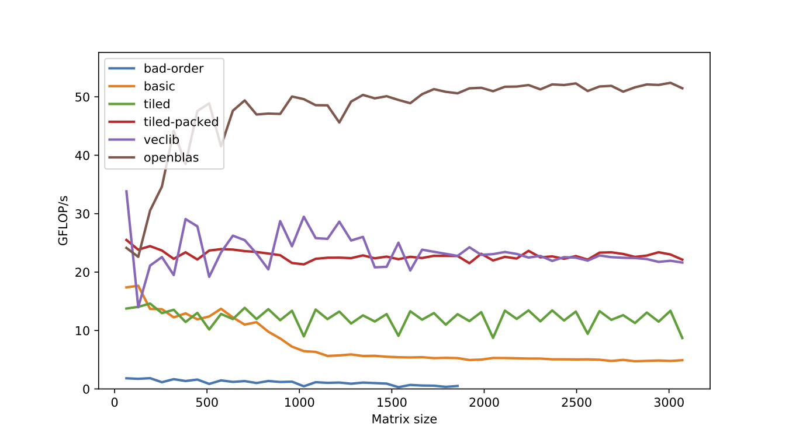

# Knowing about memory {data-background-color=#7E317B}

For better or for worse

---

## Optimising performance
## Security I: Meltdown/Spectre
## Quiz
## Security II: Rowhammer

---

## Matrix Multiplication

- Remarkable variation in FLOPS for the same FLOPs
- All dependent on working with memory architecture
- Based on [BLIS: a framework for rapidly instantiating BLAS functionality](https://dl.acm.org/citation.cfm?id=2764454)

---

## Basic

```
for (j = 0; j < n; j++) {
  for (p = 0; p < k; p++) {
    for (i = 0; i < m; i++) {
      c[j*ldc + i] = c[j*ldc + i] + a[p*lda + i] * b[j*ldb + p];
    }
  }
}
```

---

## Bad order

```
for (j = 0; j < n; j++) {
  for (i = 0; i < m; i++) {
    for (p = 0; p < k; p++) {
      c[j*ldc + i] = c[j*ldc + i] + a[p*lda + i] * b[j*ldb + p];
    }
  }
}

```

---



Thanks to Lawrence Mitchell


# Disadvantages {data-background-color=#aa2b4a}

--- 

## Meltdown/Spectre Vulnerabilities

::: incremental

- Considered "catastrophic" and "[unbelievable](https://www.bloomberg.com/news/articles/2018-01-08/-it-can-t-be-true-inside-the-semiconductor-industry-s-meltdown)"
- Identified late 2017, publicised early 2018, [reading privileged memory with a side-channel](https://googleprojectzero.blogspot.com/2018/01/reading-privileged-memory-with-side.html)
- Spectre uses speculative branching to allow one user process to access another
- Spectre affects some Intel, AMD and ARM chips
- Meltdown uses out-of-order execution with exceptions, Intel (from 2011) and possibly ARM

:::


---

## Meltdown

<https://www.youtube.com/watch?v=mgAN4w7LH2o> 

---

## Spectre

- Change CPU state depending on memory values you are not allowed to access (at location `data[offset]`)
- Speculative execution

```
if (offset < arr1->length) {
 value = arr1->data[offset];
 index2 = ((value&1)*0x100)+0x200;
 if (index2 < arr2->length) {
   value2 = arr2->data[index2];
 }
}
```

--- 

- Measure time to access `arr2->data[0x200]` and `arr2->data[0x300]`
- Depends on whether it is in cache i.e. on LSb of `value`

---

## Exploitation

- None reported in the wild
- Some variants rely on executing user code in kernel space with verified JIT eBPF bytecode execution
- Some rely on MESI protocol to keep values in cache for longer by sharing between cores
- JavaScript potentially allows remote exploitation

---

## Mitigation

- Many mitigations affect performance by flushing cache (TLB)
- Meltdown has kernel patch, Spectre doesn't
- 'Spectre may haunt us for a while'
- Intel announced fix for new hardware in October 2018
- New variants announced in November 2018
- Performance at price of security

---

## Rowhammer {data-background-color=#cfdad1}

<https://www.youtube.com/watch?v=rGaF15-ko5w> (start from 3:05)

---

## Mitigation

- DDR4 introduced Target Row Refresh (TRR)
- Stops single and double-sided rowhammer attackes
- However, [not all rowhammer attacks](https://www.bleepingcomputer.com/news/security/ddr4-memory-still-at-rowhammer-risk-new-method-bypasses-fixes/)

---

## Summary

::: incremental

- Knowing how things work can help you
  - Make things better (speedup)
  - Make things worse (vulnerability)
- Long time since anybody knew all about how a computer works
- Integrating knowledge is important
- 'May you live in interesting times'

:::


